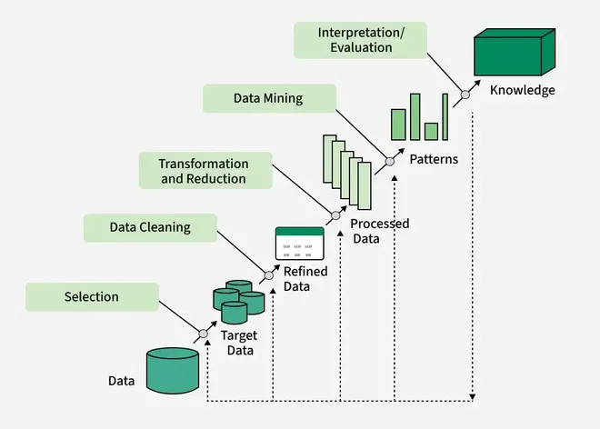

# KDD Process (Knowledge Discovery in Databases)

## WHY (KDD process ki zarurat kyun?)
Raw data:
- Noisy hota hai
- Incomplete hota hai
- Directly useful nahi hota

👉 Agar direct mining kar di jaaye to **galat patterns** aa sakte hain.  
Isliye ek **proper step-by-step process** chahiye — jise KDD kehte hain.

---

## WHAT (KDD kya hai?)
**Knowledge Discovery in Databases (KDD)** ek **overall process** hai jisme:
> Raw data ko step-by-step process karke  
> **useful, valid aur understandable knowledge** nikali jaati hai.

👉 **Data Mining = KDD ka ek step hai**, pura process nahi.

---

## HOW (KDD ke steps – FLOW me samjho)

### 1️⃣ Data Cleaning
- Missing values remove
- Noise & errors fix
- Duplicate data remove

👉 Goal: Data ko **clean aur reliable** banana

---

### 2️⃣ Data Integration
- Multiple sources ka data combine
- Databases, files, data warehouse

👉 Goal: **Single consistent dataset**

---

### 3️⃣ Data Selection
- Relevant data choose
- Unnecessary attributes remove

👉 Goal: **Sirf useful data par focus**

---

### 4️⃣ Data Transformation
- Normalization
- Aggregation
- Generalization

👉 Goal: Data ko **mining-friendly format** me lana

---

### 5️⃣ Data Mining ⭐
- Algorithms apply hote hain:
  - Classification
  - Clustering
  - Association
  - Prediction

👉 Goal: **Patterns discover karna**

---

### 6️⃣ Pattern Evaluation
- Useful vs useless patterns filter
- Interestingness measure apply

👉 Goal: **Sirf valuable patterns rakhna**

---

### 7️⃣ Knowledge Presentation
- Graphs
- Charts
- Reports
- Visualization

👉 Goal: Knowledge ko **understandable banana**

---

## DIAGRAM (Exam me draw karna)
Data → Cleaning → Integration → Selection → Transformation  
→ Data Mining → Pattern Evaluation → Knowledge

(Simple flow diagram)

---

## KDD vs Data Mining
- **KDD** = Complete process  
- **Data Mining** = Core step inside KDD

## DIAGRAM (Exam me draw karna)
Data → Cleaning → Integration → Selection → Transformation  
→ Data Mining → Pattern Evaluation → Knowledge  

(Simple flow diagram)

