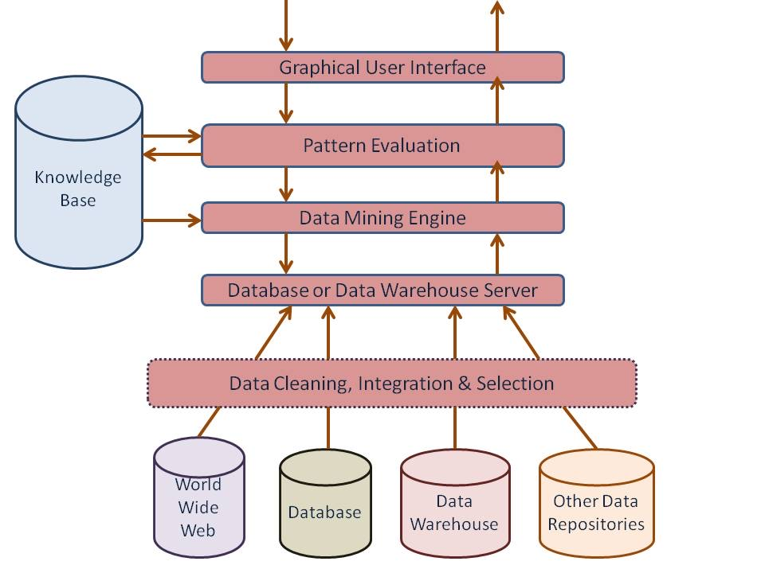

# Data Mining System Architecture

## WHY (Architecture ki zarurat kyun?)
Data Mining ek single tool nahi hai.  
Isme:
- Data aata hai
- Process hota hai
- Knowledge nikalti hai
- User use karta hai

👉 Isliye ek **proper system architecture** chahiye jisme har part ka role clear ho.

---

## OVERALL IDEA (One-line)
> Data Mining Architecture batati hai **data kaha se aata hai, kaise mine hota hai aur user tak kaise pahunchta hai**.

---

## 🏗️ COMPONENTS (Flow me samjho)

### 1️⃣ Data Sources
📦 Yahin se data aata hai:
- Databases
- Data Warehouse
- Files
- Web data

👉 *Raw material yahin se aata hai*

---

### 2️⃣ Data Warehouse Server
🏢 Central storage:
- Cleaned data
- Integrated data
- Historical data

👉 *Mining ke liye ready data yahin hota hai*

---

### 3️⃣ Knowledge Base
📚 Extra intelligence:
- Domain knowledge
- Constraints
- Threshold values

👉 *Mining engine ko guide karta hai*

---

### 4️⃣ Data Mining Engine ⭐ (CORE)
⚙️ Asli kaam yahin hota hai:
- Classification
- Clustering
- Association
- Prediction

👉 *Hidden patterns yahin discover hote hain*

---

### 5️⃣ Pattern Evaluation Module
🔍 Filter system:
- Useful vs useless patterns
- Interestingness check

👉 *Garbage patterns bahar, useful andar*

---

### 6️⃣ User Interface
🧑‍💻 User interaction:
- Query input
- Visualization
- Reports & graphs

👉 *User yahin result dekhta hai*

---

## 🔄 FLOW SUMMARY (Memory Trick)
Data → Warehouse → Mining Engine → Patterns → User

---

---

## 📊 Data Mining Architecture – Diagram (Quick Recall)

