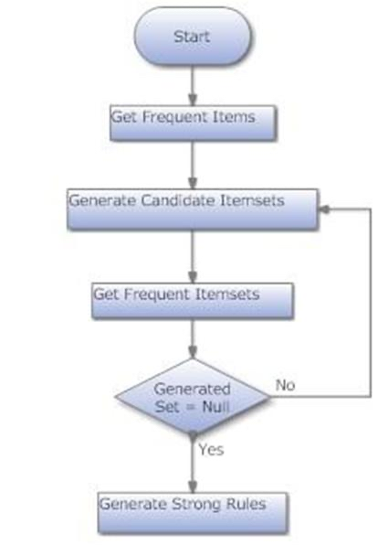

# Apriori Algorithm – Flow Based Explanation

## WHY (Apriori ki zarurat kyun?)
Large transaction databases me:
- Items bahut zyada hote hain
- Har possible combination check karna costly hota hai

Isliye need thi ek aise algorithm ki jo
**early stage par hi useless itemsets ko hata de**.

Isi problem ka solution hai **Apriori Algorithm**.

---

## WHAT (Apriori kya hai?)
Apriori ek **Association Rule Mining algorithm** hai jo:
- Frequent itemsets generate karta hai
- Minimum Support threshold ke basis par kaam karta hai

Simple words:
> Apriori batata hai kaunse items saath me frequently aate hain.

---

## CORE IDEA – APRIORI PROPERTY ⭐
> **“All subsets of a frequent itemset must also be frequent.”**

Meaning:
- Agar {A, B, C} frequent hai  
- To {A, B}, {A, C}, {B, C} bhi frequent honge

Aur agar:
- Koi subset frequent nahi hai  
→ Uska superset kabhi frequent nahi ho sakta ❌

Isi rule se **pruning possible hoti hai**.

---

## HOW (Apriori Algorithm – STEP BY STEP FLOW)

### 1️⃣ Transaction Database
Input hota hai transactions ka set, jaise:
T1: {Bread, Milk}  
T2: {Bread, Diaper, Beer}  
T3: {Milk, Diaper, Beer}

---

### 2️⃣ Candidate 1-Itemsets (C1)
- Har single item ko count kiya jata hai
- Support calculate hota hai

Ye sab **possible candidates** hote hain.

---

### 3️⃣ Frequent 1-Itemsets (L1)
- Jo items **minimum support pass** kar lete hain
- Baaki items remove ho jaate hain ❌

---

### 4️⃣ Join Step
- L1 ke itemsets ko join karke
- Larger candidate itemsets bante hain

Example:
{Bread} + {Milk} → {Bread, Milk}

---

### 5️⃣ Prune Step ⭐
- Agar kisi candidate ka **koi bhi subset infrequent** ho
- To us candidate ko **remove** kar dete hain

Ye step Apriori ko **efficient** banata hai.

---

### 6️⃣ L2, L3, … Lk Generation
- Join + Prune process repeat hota hai
- Jab tak koi naya frequent itemset na mile

---

### 7️⃣ Association Rule Generation
Frequent itemsets se rules bante hain:

Rule format:
A → B

Measures:
- **Support(A → B)** = P(A ∪ B)
- **Confidence(A → B)** = Support(A ∪ B) / Support(A)

---

## FLOW SUMMARY (Memory Friendly)
**Count → Filter → Join → Prune → Repeat**

Short form:
**C → L → Join → Prune → L**

---

## EXAM DRAWING (2-minute diagram)
Transactions  
↓  
C1 (Candidates)  
↓  
L1 (Frequent)  
↓  
Join  
↓  
Prune  
↓  
L2, L3, … Lk

---

## EXAM REALITY
- Numericals light hote hain
- Support / Confidence basic hote hain
- Flow + Property likhne se marks milte hain

---
!

## EXAM TRIGGER LINE ⭐
> **“Apriori uses the downward closure property to efficiently generate frequent itemsets by pruning infrequent candidates early.”**

---

## ONE-LINE MEMORY TRICK
👉 **Apriori = Early Pruning**